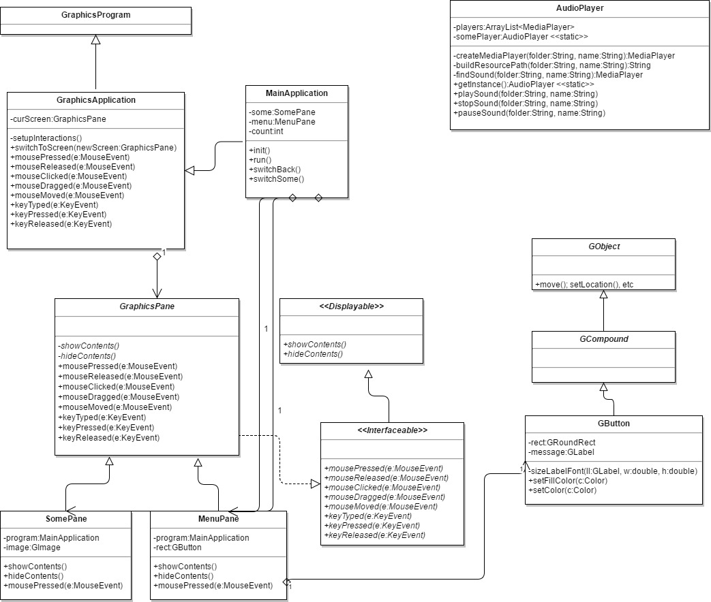

# 55starterfiles
Starter Project for Comp 55

You will use this project as your base.
Make sure that you understand the two files provided here

## UML Class Diagram for files provided

## UML Sequence Diagram for files provided

An overview of what your project is
What features are implemented and what has not yet been implemented
How to build and use the project / play the game

In this game, the overarching goal is to beat Traffic Jam.  However Traffic jam was left with three different errors.  In order to fix the errors withtin the game, you will have to beat a maze, collect bugs which will be collected in a same graphically pacman design and finally beating shooting down 20 bugs in total.  With each task beaten, you will be able to fix a bug and get closer to beating Traffic jam.  Good Luck completing the game!! 

All three levels have been implemented competely.  The sprite will also be able to move in any direction including diagnolly using the key pad to move.  The sprite will also given a rock that is used to eliminate the bugs.  The key for the weapon is the space bar.  The space bar will also be used to interact with the different features within the game like interacting with the doors.  The mouse listeners has also be implemented to intereact with the pause menu and settings.  We also have a timer which tracks every time there is a new player which would be stored on the leaderboard once the player completes the game.  If given more time we would habve switched the last level to be a boss battle which makes the game more challenging.  But besides that the whole game's function has been implemented fully.  

As mentioned above, the goal is to beat traffic jam that is filled with errors.  Once entered into the game you enter the traffic jam room but once moved an error will be popped up, which brings the player back to the main room.  The player will then navigate to the room opened which brings the player to a level in the game.  After all three levels are cleared all bugs will be cleared in Traffic Jam, and it can be ran sucessfully.  Beating the traffic Jam will mean that the player has been the game and will be entered in the leaderboard.  

##Pause menu Image - Use Case: Player Pauses the Game

##Main Room, level 1 room open -Use Case: Players explore different rooms

The first commit that I made in the old repo is bellow this line:
Overview of implementing new feature:
I am implementing a dynamic loading of UI components and their properties from a different file that allow me to edit these components' properties such as size, color without having to edit the java code file.
Pseudocode:
This section outlines the pseudocode for the file that includes UI components:
{
    "leaderboard": {
        "backgroundImage": {
            "path": "images/leaderboard_background.jpg",
            "position": {"x": 0, "y": 0},
            "size": {"width": 800, "height": 600}
        },
        "backButton": {
            "label": "Back to Menu",
            "position": {"x": 50, "y": 550},
            "size": {"width": 200, "height": 50},
            "color": "#f0e68c"
        }
    }
}
This section outlines the pseudocode for the edited java file, example of LeaderBoardPane:
Class LeaderBoardPane
    Method initUIComponents
        loader = new ConfigLoader("path/to/ui_config.json")
        //Load background image configuration
        backgroundImageConfig = loader.getComponentConfig("backgroundImage")
        Set backgroundImage properties from backgroundImageConfig
        //Load back button configuration
        backButtonConfig = loader.getComponentConfig("backButton")
        Set backButton properties from backButtonConfig
        //Add backButton event listener to switch to menu

